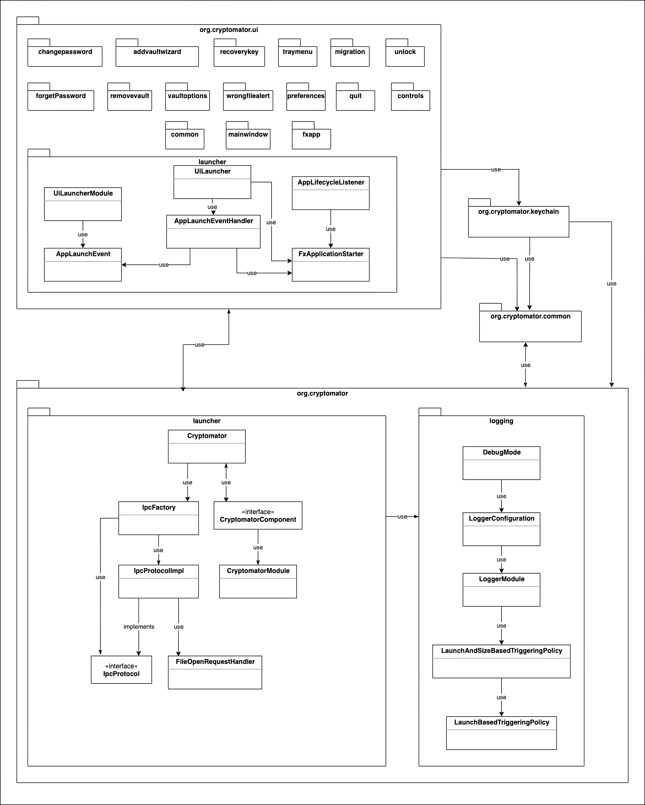
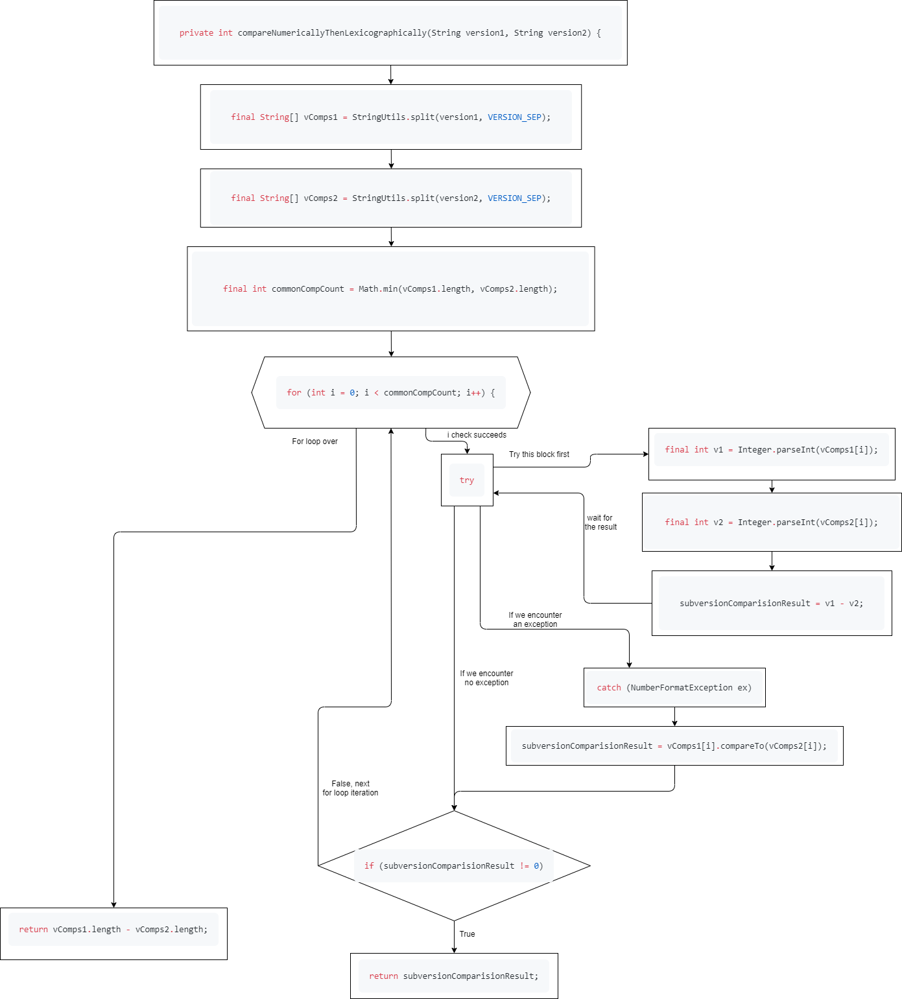
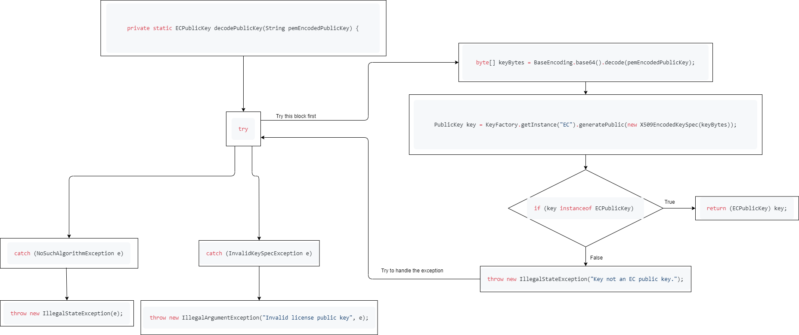

# Part 1
Draw the architecture of ​at least 3 packages and 10 classes
Draw a call graph, starting from the most prominent entry point


We chose to show the package "org.cryptomater" and its two sub-packages in detail, as this package contains the main entry point of the application. 
The other package (sub-package "launcher" of "org.cryptomator.ui") that is detailed in the graph, is the main launcher entry point of the UI.
The unexplored subpackages of the UI mostly detail UI elements and helper classes.

# Part 2
Write the data flow of six methods; ​six methods: ​two methods containing ​for loops and ​four with ​if/else statements; Each method must have 15 or more lines of code

1. located in main\commons\src\main\java\org\cryptomator\common\SemVerComparator.java
```Java
private int compare(String v1MajorMinorPatch, String v1PreReleaseVersion, String v2MajorMinorPatch, String v2PreReleaseVersion) {
	int comparisonResult = compareNumericallyThenLexicographically(v1MajorMinorPatch, v2MajorMinorPatch);
	if (comparisonResult == 0) {
		if (v1PreReleaseVersion.isEmpty()) {
			return 1; // 1.0.0 > 1.0.0-BETA
		} else if (v2PreReleaseVersion.isEmpty()) {
			return -1; // 1.0.0-BETA < 1.0.0
		} else {
			return compareNumericallyThenLexicographically(v1PreReleaseVersion, v2PreReleaseVersion);
		}
	} else {
		return comparisonResult;
	}
}
```
This method takes in four Strings as arguments and calls the method below, in order to first compare the first and third String arguments, namely v1MajorMinorPatch and v2MajorMinorPatch.
If a zero is returned, which would mean both v1MajorMinorPatch and v2MajorMinorPatch are equal, we enter the if statement. 
The first part checks, whether the String *v1PreReleaseVersion* has length 0, if so this method returns 1, because then v2 is larger, similar to the compareTo() implementation, 
else if instead the String *v2PreReleaseVersion* has length zero, a -1 is returned, and if none of these are the case, it hands the comparison with arguments v1PreReleaseVersion and v2PreReleaseVersion off to the method below and returns this result.
If the comparisonResult is not zero, meaning the v1MajorMinorPatch and v2MajorMinorPatch are not equal, we return this integer instead, and ignore v1PreReleaseVersion and v2PreReleaseVersion.


2. located in main\commons\src\main\java\org\cryptomator\common\SemVerComparator.java
```Java
private int compareNumericallyThenLexicographically(String version1, String version2) {
		final String[] vComps1 = StringUtils.split(version1, VERSION_SEP);
		final String[] vComps2 = StringUtils.split(version2, VERSION_SEP);
		final int commonCompCount = Math.min(vComps1.length, vComps2.length);

		for (int i = 0; i < commonCompCount; i++) {
			int subversionComparisionResult = 0;
			try {
				final int v1 = Integer.parseInt(vComps1[i]);
				final int v2 = Integer.parseInt(vComps2[i]);
				subversionComparisionResult = v1 - v2;
			} catch (NumberFormatException ex) {
				// ok, lets compare this fragment lexicographically
				subversionComparisionResult = vComps1[i].compareTo(vComps2[i]);
			}
			if (subversionComparisionResult != 0) {
				return subversionComparisionResult;
			}
		}

		// all in common so far? longest version string is considered the higher version:
		return vComps1.length - vComps2.length;
	}
``` 
This method takes in two versions as arguments. They are first split into String Arrays via a Version delimiter, namely a dot, and the minimum of both version array lengths is stored.
Then, using a for loop, the method iterates over this length and both version arrays and for each iteration it declares a comparison result as 0.
Both version numbers are compared using the iterating variable i to access the version arrays, and they are subtracted from eachother. If there should be an error during the subtraction, 
the comparison is then carried out lexicographically using Java's compareTo() method, for example if there are characters in the versions instead of only integers.
Taking from the Java Documentation, compareTo() returns a 0 if the argument is the same as the object it is called upon, it returns a -1 if the object is less than the argument, and it
returns a 1 if the object is larger than the argument.
If this difference after either comparison turns out to be not zero, meaning both versions are not the same at some position in the version array, the for loop is interrupted by 
the return statement of the method, which returns the integer result of the version difference at position i.
Should the for loop finish without finding a difference at any i, the method just returns the difference of both version-String array's length.
(not sure if this does actually do exactly that in the last return)




3. located in main\commons\src\main\java\org\cryptomator\common\LicenseChecker.java
```Java
private static ECPublicKey decodePublicKey(String pemEncodedPublicKey) {
	try {
		byte[] keyBytes = BaseEncoding.base64().decode(pemEncodedPublicKey);
		PublicKey key = KeyFactory.getInstance("EC").generatePublic(new X509EncodedKeySpec(keyBytes));
		if (key instanceof ECPublicKey) {
			return (ECPublicKey) key;
		} else {
			throw new IllegalStateException("Key not an EC public key.");
		}
	} catch (InvalidKeySpecException e) {
		throw new IllegalArgumentException("Invalid license public key", e);
	} catch (NoSuchAlgorithmException e) {
		throw new IllegalStateException(e);
	}
}
```



4. located in main\ui\src\main\java\org\cryptomator\ui\addvaultwizard\ChooseExistingVaultController.java
```Java
@FXML
public void chooseFileAndNext() {
	FileChooser fileChooser = new FileChooser();
	fileChooser.setTitle(resourceBundle.getString("addvaultwizard.existing.filePickerTitle"));
	fileChooser.getExtensionFilters().add(new FileChooser.ExtensionFilter("Cryptomator Masterkey", "*.cryptomator"));
	File masterkeyFile = fileChooser.showOpenDialog(window);
	if (masterkeyFile != null) {
		vaultPath.setValue(masterkeyFile.toPath().toAbsolutePath().getParent());
		try {
			Vault newVault = vaultListManager.add(vaultPath.get());
			vault.set(newVault);
			window.setScene(successScene.get());
		} catch (NoSuchFileException e) {
			LOG.error("Failed to open existing vault.", e);
			errorComponent.cause(e).window(window).returnToScene(window.getScene()).build().showErrorScene();
		}
	}
}
```
5.
BINARY SEARCH
located in main\ui\src\main\java\org\cryptomator\ui\recoverykey\AutoCompleter.java
```Java
/**
 * Find the index of the first word in {@link #dictionary} that starts with a given prefix.
 * 
 * This method performs an "unsuccessful" binary search (it doesn't return when encountering an exact match).
 * Instead it continues searching in the left half (which includes the exact match) until only one element is left.
 * 
 * If the dictionary doesn't contain a word "left" of the given prefix, this method returns an invalid index, though.
 *
 * @param begin Index of first element (inclusive)
 * @param end Index of last element (exclusive)
 * @param prefix
 * @return index between [0, dictLen], i.e. index can exceed the upper bounds of {@link #dictionary}.
 */
private int findIndexOfLexicographicallyPreceeding(int begin, int end, String prefix) {
		if (begin >= end) {
			return begin; // this is usually where a binary search ends "unsuccessful"
		}

		int mid = (begin + end) / 2;
		String word = dictionary.get(mid);
		if (prefix.compareTo(word) <= 0) { // prefix preceeds or matches word
			// proceed in left half
			assert mid < end;
			return findIndexOfLexicographicallyPreceeding(0, mid, prefix);
		} else {
			// proceed in right half
			assert mid >= begin;
			return findIndexOfLexicographicallyPreceeding(mid + 1, end, prefix);
		}
	}
```
6. located in main\ui\src\main\java\org\cryptomator\ui\recoverykey\WordEncoder.java
``` Java
/**
 * Encodes the given input as a sequence of words.
 * @param input A multiple of three bytes
 * @return A String that can be {@link #decode(String) decoded} to the input again.
 * @throws IllegalArgumentException If input is not a multiple of three bytes
 */
public String encodePadded(byte[] input) {
	Preconditions.checkArgument(input.length % 3 == 0, "input needs to be padded to a multipe of three");
	StringBuilder sb = new StringBuilder();
	for (int i = 0; i < input.length; i+=3) {
		byte b1 = input[i];
		byte b2 = input[i+1];
		byte b3 = input[i+2];
		int firstWordIndex = (0xFF0 & (b1 << 4)) + (0x00F & (b2 >> 4)); // 0xFFF000
		int secondWordIndex = (0xF00 & (b2 << 8)) + (0x0FF & b3); // 0x000FFF
		assert firstWordIndex < WORD_COUNT;
		assert secondWordIndex < WORD_COUNT;
		sb.append(words.get(firstWordIndex)).append(DELIMITER);
		sb.append(words.get(secondWordIndex)).append(DELIMITER);
	}
	if (sb.length() > 0) {
		sb.setLength(sb.length() - 1); // remove last space
	}
	return sb.toString();
}
```

7. located in main\ui\src\main\java\org\cryptomator\ui\common\PasswordStrengthUtil.java
```Java
public int computeRate(CharSequence password) {
	if (password == null || password.length() < minPwLength) {
		return -1;
	} else {
		int numCharsToRate = Math.min(PW_TRUNC_LEN, password.length());
		return zxcvbn.measure(password.subSequence(0, numCharsToRate), SANITIZED_INPUTS).getScore();
	}
}
```
This method receives an argument password, notably not as a String, but as a sequence of characters.
If this password has length 0 or its length is smaller than the required password length, this method returns a -1.
If the password is, however, not too short, it gets stripped of trailing characters, and then rated by the method measure().getScore().
This score is returned as an int.


